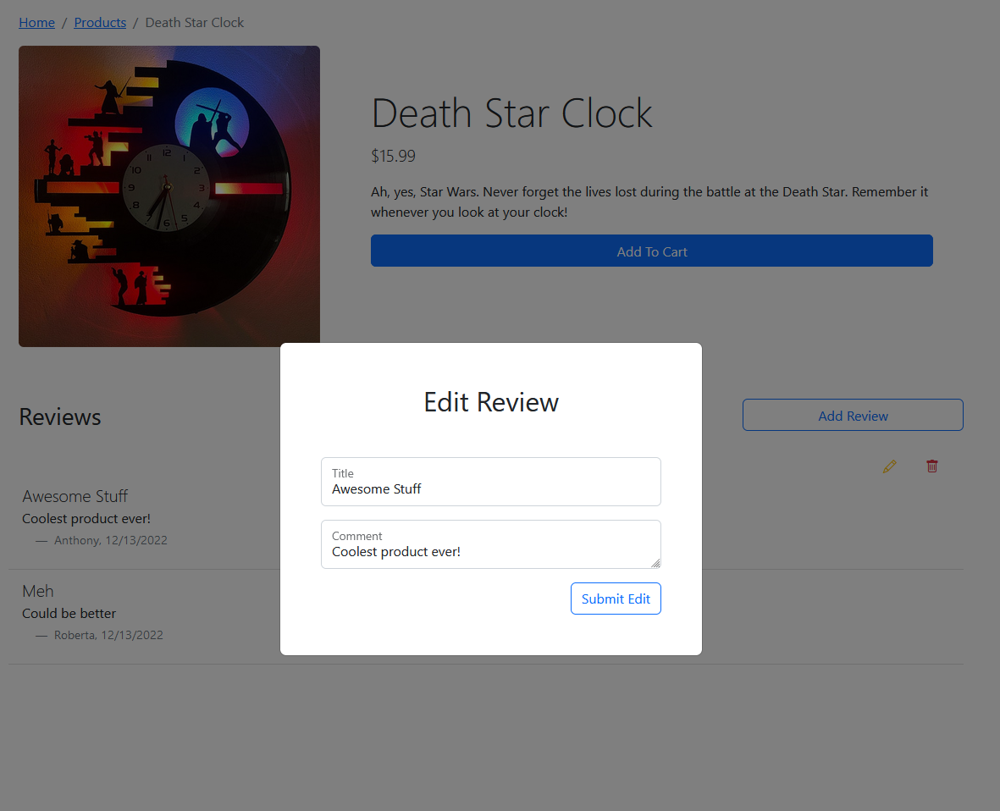

# Welcome to Shopper Tropper

## Everything you wanted, all in one spot.

Let Shopper Tropper provide you with all the household items, tools, gadgets and more that you need to make your home your own.

## Getting Started

To visit the store, please go to the [Shopper Tropper](https://sore-pink-lemming-vest.cyclic.app) website to view everything it has to offer.

Shopper Tropper can be viewed without an account to the website but in order to add items to your cart, create orders, or place reviews you must have an account. To sign up for an account simply hit the "Login" link and log in with your Google account (no passwords to remember!).

## Site Functionality

Logged in users of the site have several additional functionalities that casual visitors to the site do not have. Registered users can build shopping carts, make and edit reviews, and create orders to have items shipped to them. Examples below.

If a user is logged in they can add a review by clicking the "Add Review" button and filling out the form as seen below.

You can also edit a review by clicking the yellow pencil icon next to the review that a user has written. (A user cannot edit another user's review)

You can add products to your cart and, when ready, opt to checkout

Then, checkout!

And voilà

Lastly, users can look at their account to see their previous orders and look at the individual order details.

## Next Steps

- More detailed User page
- Users can register as a "seller" to create products and sell those products on the site

## Technologies Used

- HTML
- CSS (Bootstrap)
- JavaScript
- Mongoose/MongoDB
- EJS
- Express
- PassportJS (OAuth)
